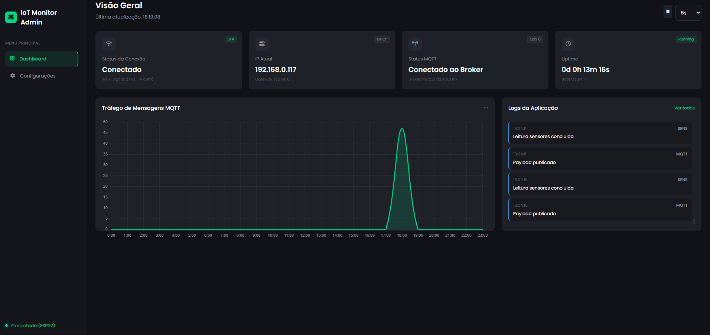
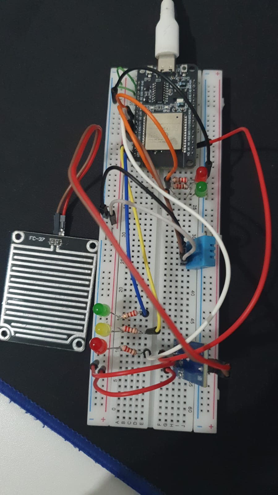
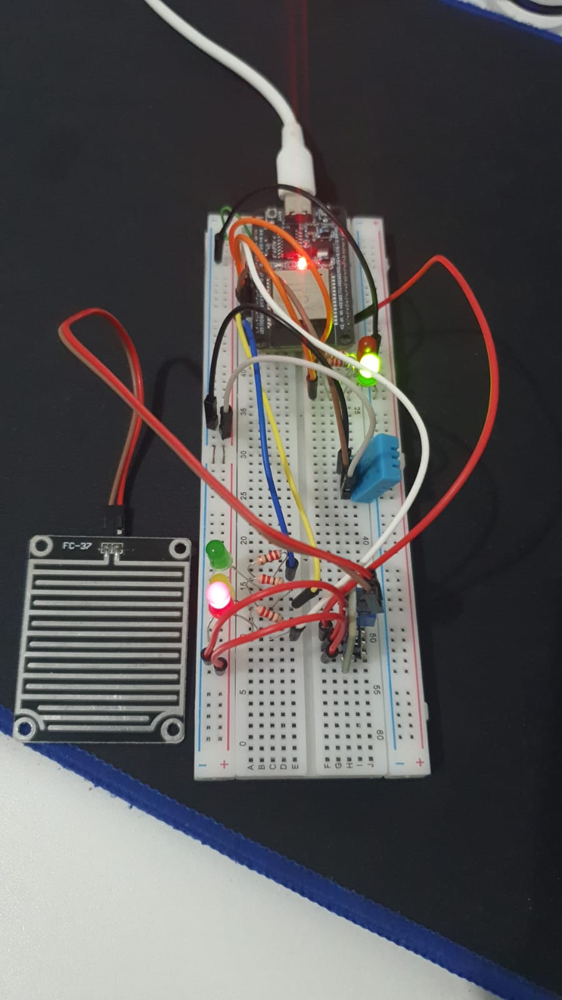

# Estação IoT ESP32 com MQTT, Dashboard Web e Alertas

Projeto para ESP32 que lê sensores de temperatura/umidade (DHT11) e chuva (FC‑37), publica telemetria via MQTT e oferece um dashboard web embarcado. O sistema suporta operação Wi‑Fi em AP ou STA, expõe um endpoint de status com informações de rede, e aciona LEDs como alertas visuais para níveis de chuva e temperatura.



## Objetivo

- Coletar e disponibilizar telemetria ambiental (temperatura, umidade, chuva) em tempo real.
- Publicar dados em `MQTT` com tópico e `QoS` configuráveis.
- Exibir um dashboard web responsivo com cartões de status e um gráfico de tráfego MQTT.
- Fornecer alertas visuais por meio de LEDs para níveis de chuva e temperatura.

## Estrutura do Projeto

```
server_32/
├── assets/                # Imagens do projeto (Fluxo, ESP32, DHT11, FC‑37)
├── main/                  # Código principal (ESP‑IDF)
│   ├── main.cpp           # Loop principal: Wi‑Fi, webserver, sensores, MQTT
│   ├── alert.{h,cpp}      # Módulo de avaliação de alertas (chuva/temperatura)
│   ├── status.{h,cpp}     # Memória da última telemetria lida
│   ├── wifi.{h,cpp}       # Inicialização Wi‑Fi (AP/STA) e utilidades
│   ├── webserver.{h,cpp}  # Servidor HTTP com endpoints e arquivos estáticos
│   ├── mqtt.{h,cpp}       # Cliente MQTT (publicação de telemetria)
│   ├── config.{h,cpp}     # Configurações persistidas em NVS
│   └── CMakeLists.txt     # Registro dos fontes no componente
├── web/                   # Frontend do dashboard
│   ├── index.html         # Layout de cartões e gráfico
│   ├── script.js          # Atualização dinâmica e integração com endpoints
│   └── style.css          # Estilos responsivos (chart ocupa 100% do card)
├── CMakeLists.txt         # Projeto (top-level)
├── partitions.csv         # Tabela de partições (inclui SPIFFS)
├── sdkconfig              # Configuração do build (ESP‑IDF)
└── README.md              # Este documento
```

## Funcionalidades

- Wi‑Fi AP/STA
  - Inicia em `STA` quando `SSID`/`password` estão configurados; caso contrário, sobe AP para configuração inicial.
  - Endpoint `/status` expõe `mode`, `ip`, `gw` (gateway), `rssi` e `uptime_ms`.
  - Identificação visual na UI: badges AP/DHCP e RSSI (dBm e %).

- Dashboard Web
  - Cartões dinâmicos: Wi‑Fi (modo, sinal, IP, gateway), MQTT (status, QoS, broker), Uptime.
  - Gráfico de tráfego MQTT responsivo ocupando 100% do card.
  - Consome `/status` e `/api/config` para atualizar os elementos.

- Sensores
  - DHT11 (GPIO 21): temperatura e umidade.
  - FC‑37 (ADC1_CHANNEL_6 = GPIO 34): leitura analógica, convertida para porcentagem de chuva.
  - Publica JSON: `{"dht_temp": <float>, "dht_hum": <float>, "rain_pct": <int>}`.

- MQTT
  - Tópico padrão `esp/sensors` ou o definido em configuração.
  - `QoS` configurável (`0`, `1` ou `2`).
  - Conecta apenas se há rede e broker configurado.

- Alertas por LED
  - Pinos:
    - Chuva: `GPIO 23` (verde), `GPIO 22` (amarelo), `GPIO 18` (vermelho).
    - Temperatura: `GPIO 19` (verde), `GPIO 17` (vermelho).
  - Regras:
    - Chuva: `0%` → verde; `1–60%` → amarelo; `≥61%` → vermelho.
    - Temperatura: `≤30°C` → verde; `>30°C` → vermelho.
  - Apenas um LED de cada grupo acende por vez.

- Endpoints HTTP
  - `GET /status` → estado do Wi‑Fi, RSSI, uptime e outros campos.
  - `GET /api/config` → configuração carregada (broker, QoS, tópico etc.).
  - UI estática servida de `web/` (SPIFFS).

### Fluxo Geral

A coleta e publicação de dados segue o fluxo abaixo e é refletida no dashboard:


## Componentes Utilizados

- Placa ESP32

  

- Sensor DHT11

  

- Sensor de chuva FC‑37

  

## Protótipo

Fotos do protótipo físico montado com ESP32, DHT11 e FC‑37, indicando ligações e posicionamento dos componentes:

<div style="display: flex; justify-content: center; align-items: center;">



</div>

## Tecnologias e Ambiente

- ESP‑IDF (ESP32 SDK) com FreeRTOS
- `esp_http_server` para servir UI e endpoints
- `lwIP` para rede e obtenção de gateway/RSSI
- Cliente `MQTT` do ESP‑IDF
- `SPIFFS` para armazenar arquivos da UI (`web/`)
- Frontend com HTML/CSS/JavaScript e `Chart.js` (gráfico responsivo)
- NVS para persistir configurações (SSID, senha, broker, QoS, tópico)

## Como Rodar o Projeto

1. Preparar o ambiente ESP‑IDF (Windows)
   - Instalar ESP‑IDF (v5.x recomendado) e configurar o terminal.
   - No primeiro uso, selecione o alvo: `idf.py set-target esp32`.

2. Build e Flash
   - `idf.py build`
   - `idf.py -p COMx flash` (substitua `COMx` pela porta correta)
   - `idf.py -p COMx monitor`

3. Acesso à UI
   - Em `STA`: após obter IP, acesse `http://<ip>/`.
   - Em `AP`: acesse `http://192.168.4.1/` (SSID padrão `Admin_AP`).

4. Configurar MQTT
   - Na UI, defina `Broker` (ex.: `mqtt://192.168.1.100`), `Porta`, `QoS` e `Tópico`.
   - Salve e reinicie, verifique no broker (ex.: Mosquitto) as mensagens publicadas.

5. Validar LEDs de alerta
   - Conecte LEDs com resistores (220–1kΩ) aos pinos indicados.
   - Simule chuva no FC‑37 e variações de temperatura no DHT11 para ver os estados.

## Contribuidores

- João José [@Johnymonteiiro](https://github.com/Johnymonteiiro)
- João José [@Johnymonteiiro](https://github.com/Johnymonteiiro)
- João José [@Johnymonteiiro](https://github.com/Johnymonteiiro)

## Conclusão

Este projeto integra sensores, conectividade MQTT e uma UI embarcada para monitoramento em tempo real, além de alertas visuais simples via LEDs. A arquitetura modular (Wi‑Fi, webserver, MQTT, status, alertas) facilita ajustes de limiar, mapeamento de pinos e expansão futura (novos sensores, páginas, endpoints). Para melhorias, recomenda‑se expor `boot_count` e SSID em `/status` e adicionar testes de hardware (debounce/estabilização) aos sensores conforme o ambiente.

## Glossário de Siglas

- AP: Access Point — modo em que o ESP32 cria uma rede Wi‑Fi própria para configuração/uso local.
- STA: Station — modo cliente em que o ESP32 conecta‑se a um roteador Wi‑Fi existente.
- NVS: Non‑Volatile Storage — armazenamento interno persistente para configurações (SSID, senha, broker etc.).
- SPIFFS: SPI Flash File System — sistema de arquivos na flash, usado para servir os arquivos da UI (web/).
- RSSI: Received Signal Strength Indicator — intensidade do sinal Wi‑Fi (em dBm); mais negativo significa sinal mais fraco.
- QoS: Quality of Service — nível de garantia de entrega de mensagens MQTT (`0`, `1`, `2`).
- MQTT: Message Queuing Telemetry Transport — protocolo leve de publicação/assinatura para IoT.
- HTTP: Hypertext Transfer Protocol — protocolo usado pelo servidor web embarcado para servir páginas e endpoints.
- ADC: Analog‑to‑Digital Converter — conversor analógico/digital usado para ler o FC‑37.
