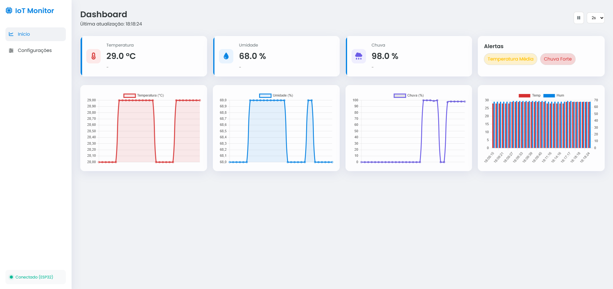

# Monitor App ESP32 — Dashboard IoT e Configuração via Web

Aplicação IoT para ESP32 que expõe uma interface web moderna (SPA) hospedada em SPIFFS para monitoramento de dados e configuração de rede/MQTT. O fluxo de operação alterna entre modo AP e STA: no AP, o dispositivo publica um portal de configuração; após salvar, conecta-se em STA e disponibiliza um dashboard com métricas e alertas. Persistência de configurações na NVS e integração com MQTT permitem uso em ambientes domésticos e laboratoriais.



## Objetivo

- Disponibilizar uma interface amigável para configurar Wi‑Fi e MQTT diretamente pelo navegador.
- Monitorar dados (temperatura, umidade, chuva) e exibir alertas de nível.
- Integrar com um broker MQTT para receber/produzir dados e comandos.
- Operar em modo AP quando não houver configuração válida e em STA quando configurado.

## Estrutura do Projeto

```
monitor_app/
├─ main/
│  ├─ main.cpp                # boot do app, inicialização de serviços
│  ├─ wifi.cpp/.h             # gerência de Wi‑Fi (AP/STA, fallback STA→AP)
│  ├─ web-server.cpp/.h       # HTTP server, endpoints e SPA
│  ├─ mqtt.cpp/.h             # cliente MQTT (guarda para AP/sem IP)
│  ├─ config-manager.cpp/.h   # persistência NVS (salvar/ler/limpar)
│  ├─ app.config.h            # estrutura de configuração
│  ├─ SensorData.cpp/.h       # dados globais de sensores (temp, hum, rain)
│  ├─ alerts.cpp/.h           # avaliação de alertas (temperatura e chuva)
│  └─ CMakeLists.txt          # registro do componente
├─ web/
│  ├─ index.html              # SPA (dashboard, configurações)
│  ├─ script.js               # lógica de UI, gráficos e chamadas à API
│  └─ style.css               # estilos
├─ partitions.csv             # tabela de partições (inclui SPIFFS: storage)
├─ CMakeLists.txt             # criação da imagem SPIFFS (web → storage)
└─ sdkconfig                  # configuração do projeto (ESP‑IDF)
```

## Funcionalidades

- Portal de Configuração (modo AP):
  - Rede: SSID e senha
  - MQTT: broker (URI), porta, QoS, tópico, usuário/senha
  - Persistência na NVS e reinicialização após salvar
- Dashboard (modo STA):
  - Métricas: temperatura, umidade, chuva
  - Gráficos interativos (Chart.js) e deltas
  - Alertas (badges) para temperatura e chuva
- Endpoints HTTP:
  - `GET /api/dados` — JSON com métricas e `alerts`
  - `GET /api/config` — leitura das configurações salvas
  - `POST /api/config` — gravação de configurações (reinicia)
  - `POST /api/config/clear` — limpa NVS (reinicia)
- Imagem de Fluxo: consulte `assets/fluxo-app.png` para visualizar o fluxo AP→STA, endpoints e integração MQTT.

## Fluxo


- No AP (`Monitor_Wi‑Fi`), o ESP32 expõe a página de Configurações para salvar Wi‑Fi/MQTT.
- Após salvar, o dispositivo reinicia e entra em STA, disponibilizando o Dashboard.
- O Dashboard consome `GET /api/dados` e exibe métricas e alertas; a configuração pode ser lida/salva/limpa via `/api/config`.
- Integração com o broker MQTT permite receber dados de sensores e publicar eventos.

## Componentes (com imagens em assets)

- ESP32 Dev Board (ex.: ESP32‑WROOM): `assets/components/esp32.jpg`

## Tecnologias e Ambiente

- ESP‑IDF 5.5.1 (CMake + Ninja)
- C/C++ (classes para organização)
- FreeRTOS (event groups para IP STA)
- SPIFFS (servidor de arquivos estático)
- HTTP Server (`esp_http_server`)
- MQTT (`esp-mqtt`)
- JSON (`cJSON`)
- Ambiente: Windows + ESP‑IDF (PowerShell/VSCode)

## Como Rodar

1. Preparação do ambiente (ESP‑IDF instalado e configurado):
   - `idf.py set-target esp32`
2. Build da imagem SPIFFS e firmware:
   - `idf.py fullclean`
   - `idf.py reconfigure`
   - `idf.py build`
3. Gravação e monitor:
   - `idf.py flash monitor`
4. Primeira configuração (AP):
   - Conecte à rede `Monitor_Wi‑Fi`
   - Acesse `http://192.168.4.1/`
   - Salve credenciais Wi‑Fi/MQTT
5. Operação (STA):
   - Após reiniciar, o ESP conecta na rede configurada
   - Acesse pelo IP obtido via DHCP, ex.: `http://<ip_sta>/`
6. Limpar NVS:
   - Botão “Deletar os dados” na página de configurações
   - Dispositivo reinicia e volta ao AP

## Contribuidores

- João José [@Johnymonteiiro](https://github.com/Johnymonteiiro)
- Abraão Sacaia [@AbraaoSacaia](https://github.com/AbraaoSacaia)

## Conclusão

Este projeto fornece um fluxo completo de provisionamento e operação para ESP32 com UI moderna, persistência de configuração e integração MQTT. A alternância AP→STA oferece uma experiência de setup simples, enquanto o dashboard em STA entrega métricas e alertas em tempo real. 
